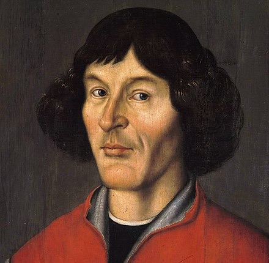

# 尼古拉·哥白尼

## 简介

::: info

尼古拉·哥白尼（拉丁語：Nicolaus Copernicus，波蘭語：Mikołaj Kopernik，1473年2月19日—1543年5月24日）是文艺复兴时期的波兰数学家、天文学家，他提倡日心说模型，提到太陽為宇宙的中心[1]。1543年哥白尼临终前发表了《天體運行論》一般認為他著的是現代天文學的起步點。它开启了哥白尼革命，并对推动科学革命有相當大的贡献。

哥白尼出生于皇家普魯士，该地区自1466年隶属于波兰王国。哥白尼获得了教会法规博士学位，同时也是一名医生，通晓多国语言，了解古典文学，能够胜任翻译，做过执政官、外交官，也是一名经济学家（后续几项都没有学历学位）。1517年，哥白尼总结了货币量化理论[2]，成为当今经济学的重要基础之一。1519年，哥白尼在托马斯·格雷沙姆之前总结出劣幣驅逐良幣理论的前身[
:::

## 小哥白尼

[《小哥白尼.军事科学》](https://www.cdstm.cn/gallery/media/mkjx/xgbnjskx/)
[《小哥白尼•趣味科学》](https://www.cdstm.cn/gallery/media/mkjx/xgbnqwkx/)